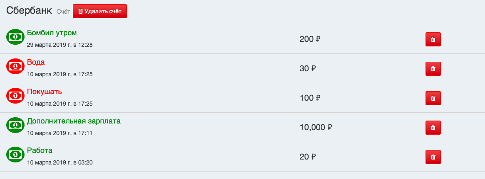

# Создание новых транзкций (доход/расход)



## Общее описание

Необходимо разработать виджет *TransactionsWidget* 
(public/файл js/ui/widgets/TransactionsWidget.js), 
а также форму *CreateTransactionForm* 
(файл *public/js/ui/forms/CreateTransactionForm.js*)

## TransactionsWidget

Класс *TransactionsWidget* отвечает за следующие функции:

1. Добавление нового дохода
2. Добавление нового расхода

Код виджета представлен следующим образом:

```html
<div class="transactions-panel">
    <button class="btn btn-success btn-block create-income-button">
        <span class="fa fa-thumbs-o-up"></span>
        Доход
    </button>
    <button class="btn btn-danger btn-block create-expense-button">
        <span class="fa fa-thumbs-o-down"></span>
        Расход
    </button>
</div>
```

### Структура 

Класс состоит из следующих методов:

1. Конструктор
2. *registerEvents* - открывает всплывающие окна расхода или дохода

### constructor

Инициализирует виджет. 

1. Устанавливает передаваемый аргумент *element* в 
свойство *element*.
2. Вызывает метод *registerEvents*

### registerEvents 

1. При нажатии на кнопку «Доход» отображает всплывающее окно
«Новый доход» (*#modal-new-income*) с помощью метода *App.getModal*
2. При нажатии на кнопку «Расход» отображает всплывающее окно
«Новый доход» (*#modal-new-expense*) с помощью метода *App.getModal*

## CreateTransactionForm

Форма *CreateTransactionForm* отправляет запрос на создание
дохода или расхода. Обратите внимание, что в приложении
есть два экземпляра этой формы - одна для дохода (*#new-income-form*)
и одна для расхода (*#new-expense-form*).

Форма наследуется от *AsyncForm*.

Рассмотрим форму расхода:

```html
<div class="modal fade in" id="modal-new-expense" data-modal-id="newExpense">
    <div class="modal-dialog">
        <div class="modal-content">
            <div class="modal-header">
                <button type="button" class="close" data-dismiss="modal" aria-label="Закрыть">
                    <span aria-hidden="true">×</span></button>
                <h4 class="modal-title">Новый расход</h4>
            </div>
            <div class="modal-body">
                <form class="form" id="new-expense-form">
                    <input name="type" type="hidden" value="expense">

                    <div class="form-group">
                        <input type="text" class="form-control" placeholder="Название" name="name" required>
                    </div>

                    <div class="form-group">
                        <input type="text" class="form-control" placeholder="Сумма" name="sum" required>
                    </div>

                    <div class="form-group">
                        <label for="expense-accounts-list"></label>
                        <select name="account_id" id="expense-accounts-list" class="form-control accounts-select" required></select>
                    </div>
                </form>
            </div>
            <div class="modal-footer">
                <button type="button" class="btn btn-default pull-left" data-dismiss="modal">Закрыть</button>
                <button type="submit" class="btn btn-primary" form="new-expense-form">Создать</button>
            </div>
        </div>
    </div>
</div>
```

Обратите внимание на то, что в коде есть блок:

```html
<select name="account_id" id="expense-accounts-list" class="form-control accounts-select" required></select>
```

Этот список будет меняться каждый раз, когда счет будет
добавляться или удаляться из приложения.

### Структура

Форма состоит из 3 частей:

1. Конструктор
2. *renderAccountsList* - подгружает список активных счетов
3. *onSubmit* - выполняется при отправке формы

### constructor

Вызывает метод *renderAccountsList*

### renderAccountsList

С помощью метода *Account.list* подгружает текущие счета
пользователя в выпадающий список

В коде формы есть

```html
<select name="account_id" id="expense-accounts-list" class="form-control accounts-select" required></select>
```

При создании формы необходимо подгрузить 
туда список счетов (с помощью *Account.list*) в формате:

```html
<option value="${id}">${name}</option>
``` 

где *id* - идентификатор полученного счета, *name* - имя счета

В случае, 
если в приложении добавляется или удаляется счёт, необходимо
обновить этот список (как это сделать, будет указано отдельно).

### onSubmit

Вызывает метод *Transaction.create* и передаёт ему данные формы.

1. В случае успешного ответа сбрасывает форму
2. В случае успешного ответа закрывает всплывающее окно,
в котором находится данная форма
3. В случае успешного ответа вызывает метод *App.update* для
обновления информации о приложении
